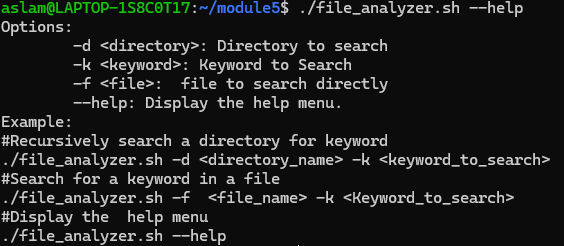

## Code Overview

### Script: `file_analyzer.sh`
```bash
#!/bin/bash

logFile='errors.log'

function ErrorFile(){

        echo "[ERROR] :$1" >> "$logFile" && cat "$logFile"
}

Help(){
        #Here Document for help
        cat << END
Options:
        -d <directory>: Directory to search
        -k <keyword>: Keyword to Search
        -f <file>:  file to search directly
        --help: Display the help menu.
Example:
#Recursively search a directory for keyword
./file_analyzer.sh -d <directory_name> -k <keyword_to_search>
#Search for a keyword in a file
./file_analyzer.sh -f  <file_name> -k <Keyword_to_search>
#Display the  help menu
./file_analyzer.sh --help
END

}

recursiveSearch(){
        local directory=$1
        local keyword=$2
        if [[ ! -d "$directory" ]]; then
                ErrorFile "Invalid Directory $directory or may be it\'s not accesible"
                return 1
        fi
        for i in "$directory"/*;do
                if [[ -d $i ]]; then
                        recursiveSearch "$i" "$keyword"
                elif [[ -f $i ]]; then
                        grep -q "$keyword" "$i"
                        if [[ $? -eq 0 ]];then
                                echo "FileName: $i, Keywords found!:)"
                        else
                                echo "FileName: $i, Keywords Not found:("
                        fi
                fi
        done
}

function fileSearch(){
        local fileName=$1
        local key=$2
        grep -q "$key" "$fileName"
        if [[ $? -eq 0 ]]; then
                echo "FileName: $fileName, Keywords found!:)"
        else
                ErrorFile "No Matching Keywords found:("
        fi
}
if [[ $1 == '--help' ]]; then
        Help
        exit 0
fi


#--------------------
#commands line arguments
directory=""
file=""
key=""

#--------------------

while getopts "d:f:k:" args;do
        case "$args" in
                d)
                        directory="$OPTARG"
                        ;;
                f)
                        file="$OPTARG"
                        ;;
                k)
                        key="$OPTARG"
                        ;;
                ?)
                        ErrorFile "Invalid Args"
                        Help
                        exit 1
        esac
done

if [[ -z "$key" ]]; then
        ErrorFile "Key Shouldnot be Empty --help make use of help to see the details"
        exit 1
fi

if echo "$key" | grep -Eq '^[a-zA-Z0-9._ @-]+$'; then
        echo 'Keywords are valid'
else
        ErrorFile "KeyWords are invalid"
        exit 1
fi
#-------------------------------------
#Special Parameters
echo "File Name: $0"
echo "No.of Args: $#"
echo "Args: $@"
echo "PID: $$"
#-------------------------------------

if [[ -n  "$directory" ]]; then
        recursiveSearch "$directory" "$key"

elif [[ -n "$key" ]]; then
        fileSearch "$file" "$key"
else
        ErrorFile "No target specified. Please provide a directory (-d) or a file (-f) to search."
        Help
        exit 1
fi

exit 0
```
---
###Screenshots
1. **Recursive Search in a Directory**:
```bash
./file_analyzer.sh -d logs -k how
```

2. **Search in a Specific File with Errors Logged**:
```bash
./file_analyzer.sh -f file3.txt -k hw
```


3.**Search in a Specific File without errors Logged**:
```bash
./file_analyzer.sh -f file3.txt -k h_w
```

4. **Display the Help Menu**:
```bash
./file_analyzer.sh --help
```



---


