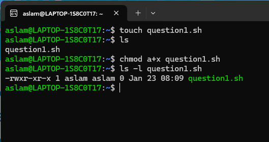
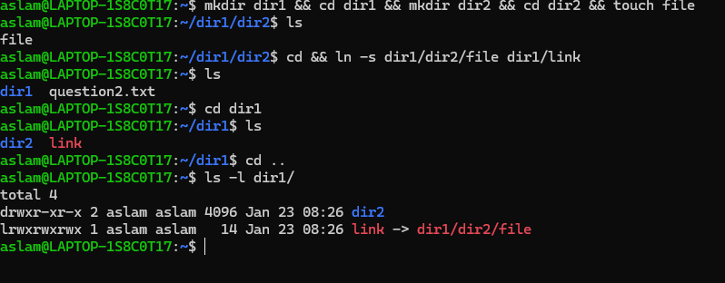
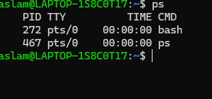

# Task Demonstration and Commands with Screenshots

This document provides detailed steps and screenshots for performing various Linux tasks.

---

## 1. Create a File and Add Executable Permission for All Users

### Command Steps:
1. Create the file:
   ```bash
   touch question1.sh
   ```
2. Add executable permissions for all users:
   ```bash
   chmod a+x question1.sh
   ```
3. Verify the permissions:
   ```bash
   ls -l question1.sh
   ```

### Screenshot:


---

## 2. Create a File and Remove Write Permission for Group Users

### Command Steps:
1. Create the file:
   ```bash
   touch question2.txt
   ```
2. Remove write permissions for the group:
   ```bash
   chmod g-w question2.txt
   ```
3. Verify the permissions:
   ```bash
   ls -l question2.txt
   ```

### Screenshot:


---

## 3. Create a File and Add a Softlink to It in a Different Directory

### Command Steps:
1. Create directories and file:
   ```bash
   mkdir -p dir1/dir2 && touch dir1/dir2/file
   ```
2. Add a soft link to the file inside `dir1`:
   ```bash
   ln -s dir1/dir2/file dir1/link
   ```
3. Verify the soft link:
   ```bash
   ls -l dir1
   ```

### Screenshot:


---

## 4. Use `ps` Command to Display All Active Processes

### Command Steps:
Run the `ps` command to list active processes:
```bash
ps
```

### Screenshot:


---

## 5. Create 3 Files in a Directory and Redirect Sorted `ls` Output

### Command Steps:
1. Create three files:
   ```bash
   mkdir dir1 && cd dir1 && touch file1 file2 file3
   ```
2. List the files sorted by timestamp and redirect the output to a file:
   ```bash
   ls -lt dir1 > dir1/op.txt
   ```
3. Verify the redirected output:
   ```bash
   cat dir1/op.txt
   ```

### Screenshot:


---

These tasks demonstrate basic Linux commands for file management, permission modification, process viewing, and symbolic link creation.

