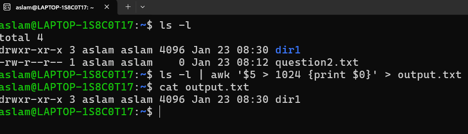
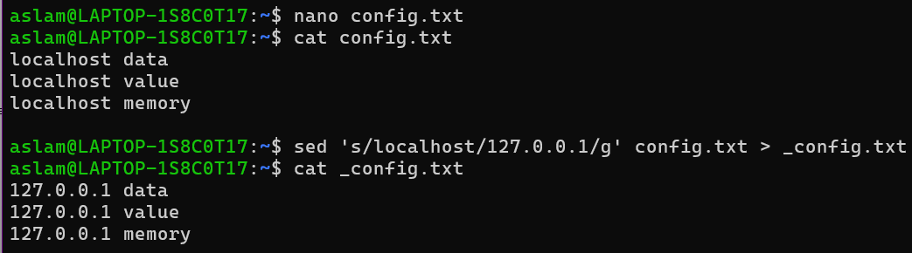
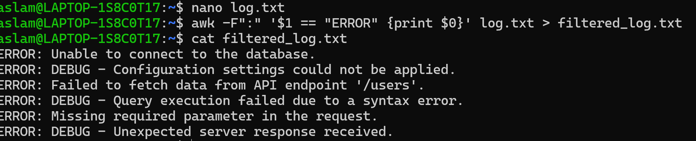
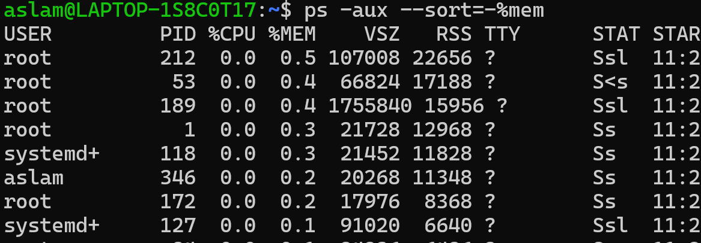
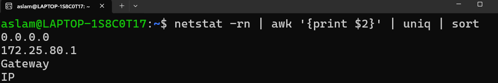

# Task Demonstration and Commands with Screenshots

## Name: Mohamed Aslam
## College: Mepco Schlenk Engineering College
---
## 1. List Files Larger Than 1 MB

### Command Steps:
1. Run the following command to list all files larger than 1 MB and save the output:
   ```bash
   ls -l | awk '$5 > 1024 {print $0}' > output.txt
   ```
2. Verify the content of `output.txt`:
   ```bash
   cat output.txt
   ```

### Screenshot:


---

## 2. Replace "localhost" with "127.0.0.1" in a File

### Command Steps:
1. Create a file `config.txt` with sample data:
   ```bash
   nano config.txt
   ```
2. Replace all occurrences of `localhost` with `127.0.0.1` and save the updated file:
   ```bash
   sed 's/localhost/127.0.0.1/g' config.txt > _config.txt
   ```
3. Verify the changes:
   ```bash
   cat _config.txt
   ```

### Screenshot:


---

## 3. Filter Lines Containing "ERROR" in a Log File

### Command Steps:
1. Create a log file `log.txt` with sample data:
   ```bash
   nano log.txt
   ```
2. Use `awk` to filter lines containing the word "ERROR" and save the result:
   ```bash
   awk -F":" '$1 == "ERROR" {print $0}' log.txt > filtered_log.txt
   ```
3. View the filtered results:
   ```bash
   cat filtered_log.txt
   ```

### Screenshot:


---

## 4. Display All Active Processes and Terminate the Highest Memory Consumer

### Command Steps:
1. List all active processes sorted by memory usage:
   ```bash
   ps aux --sort=-%mem
   ```
2. Kill the process consuming the most memory:
   ```bash
   kill $(ps aux --sort=-%mem | awk 'NR==2 {print $2}')
   ```

### Screenshot:
  


---

## 5. Extract and Sort IP Addresses Using `netstat` and `awk`

### Command Steps:
1. Use `netstat` to list network connections, extract IPs, and sort them:
   ```bash
   netstat -rn | awk '{print $2}' | uniq | sort
   ```

### Screenshot:


---