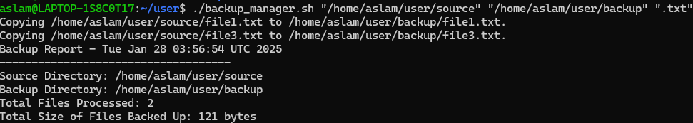
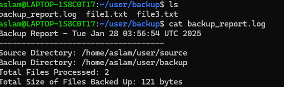

---
## Name: Mohamed Aslam K
## College: Mepco Schlenk Engineering College

---

## Code Overview

### Script: `backup_manager.sh`
```bash
#!/bin/bash

# Check if the correct number of arguments is provided
if [ $# -ne 3 ]; then
    echo "Usage: $0 <source_directory> <backup_directory> <file_extension>"
    exit 1
fi

SOURCE_DIR="$1"
BACKUP_DIR="$2"
FILE_EXT="$3"

# Check if the source directory exists
if [ ! -d "$SOURCE_DIR" ]; then
    echo "Error: Source directory '$SOURCE_DIR' does not exist."
    exit 1
fi

# Check if the backup directory exists, create it if not
if [ ! -d "$BACKUP_DIR" ]; then
    echo "Backup directory '$BACKUP_DIR' does not exist. Creating it..."
    mkdir -p "$BACKUP_DIR"
    sleep 2
    echo "Backup Directory Created!! :)"
fi

# Globbing: Get files with the specified extension
FILES=("$SOURCE_DIR"/*"$FILE_EXT")

# Check if there are any matching files in the source directory
if [ ${#FILES[@]} -eq 0 ] || [ ! -e "${FILES[0]}" ]; then
    echo "No files with extension '$FILE_EXT' found in '$SOURCE_DIR'. Exiting."
    exit 0
fi

#Exporting FILE_COUNT as Environment Variable
export FILE_COUNT=0
TOTAL_SIZE=0

for FILE in "${FILES[@]}"; do
    [[ -e "$FILE" ]] || continue

    DEST_FILE="$BACKUP_DIR/$(basename "$FILE")"
    if [ -e "$DEST_FILE" ]; then
        if [ "$FILE" -nt "$DEST_FILE" ]; then
            echo "Updating $DEST_FILE (newer source file)."
            cp --preserve=all "$FILE" "$DEST_FILE"
        else
            echo "Skipping $DEST_FILE (already up-to-date)."
            continue
        fi
    else
        echo "Copying $FILE to $DEST_FILE."
        cp --preserve=all "$FILE" "$DEST_FILE"
    fi

    FILE_COUNT=$((FILE_COUNT + 1))
    FILE_SIZE=$(stat -c%s "$FILE")
    TOTAL_SIZE=$((TOTAL_SIZE + FILE_SIZE))
done

# Output report
REPORT_FILE="$BACKUP_DIR/backup_report.log"
{
    echo "Backup Report - $(date)"
    echo "------------------------------------"
    echo "Source Directory: $SOURCE_DIR"
    echo "Backup Directory: $BACKUP_DIR"
    echo "Total Files Processed: $FILE_COUNT"
    echo "Total Size of Files Backed Up: $TOTAL_SIZE bytes"
} > "$REPORT_FILE"

cat "$REPORT_FILE"

exit 0
```

---

## Screenshots

### 1. Script Execution
The command to execute the script:
```bash
./backup_manager.sh "/home/aslam/user/source" "/home/aslam/user/backup" ".txt"
```

Output:


---

### 2. Source Directory Contents
The `source` directory contains multiple files. The script filters and backs up only `.txt` files.


---

### 3. Backup Directory Contents and Report
The `backup` directory contains the `.txt` files that were backed up, along with the `backup_report.log`.

Backup Report Example:
```plaintext
Backup Report - Tue Jan 28 03:56:54 UTC 2025
------------------------------------
Source Directory: /home/aslam/user/source
Backup Directory: /home/aslam/user/backup
Total Files Processed: 2
Total Size of Files Backed Up: 121 bytes
```



---