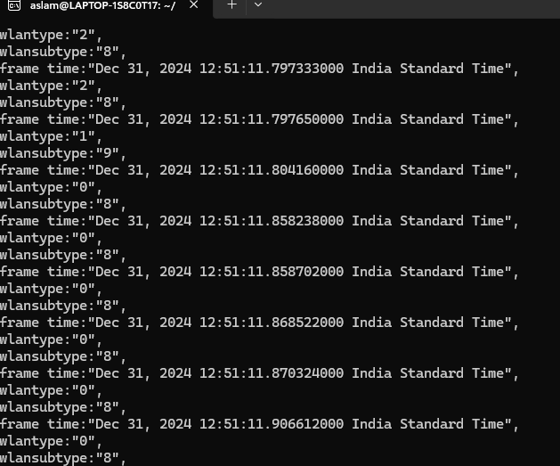

---
## Name: Mohamed Aslam K
## College: Mepco Schlenk Engineering College

---

## Code Overview

### Script: `file_extraction.sh`
```bash
#!/bin/bash

# Checking Number of CL Args
if [ "$#" -ne 1 ]; then
    echo "Input File Not Given"
    exit 1
fi

input="$1"
output="output.txt"

# Clear the output file if it exists
> "$output"

while IFS= read -r line; do
    if [[ "$line" == *"frame.time"* && "$line" != *"frame.time_"* ]]; then
        frame_time=$(echo "$line" | awk -F': ' '{print $2}')
        echo "frame time:$frame_time" >> "$output"

    elif [[ "$line" == *"wlan.fc.type"* && "$line" != *"wlan.fc.type_"* ]]; then
        wlan_type=$(echo "$line" | awk -F': ' '{print $2}')
        echo "wlantype:$wlan_type" >> "$output"

    elif [[ "$line" == *"wlan.fc.subtype"* && "$line" != *"wlan.fc.subtype_"* ]]; then
        wlan_sub_type=$(echo "$line" | awk -F': ' '{print $2}')
        echo "wlansubtype:$wlan_sub_type" >> "$output"
    fi
done < "$input"

echo "Output saved to $output"
```

---

## Screenshots

### 1. Script Execution
The command to execute the script:
```bash
./file_extraction.sh input.txt
```

Output:


---

### 2. Saving as output.txt
The `output.txt` contains filtered contents through wildcard string matching on the condition matching. The script filters `frame.time` `wlan.fc.type` `wlan.fc.subtype` from the `input.txt`.



---
