# Networking Training Program (Module 1 & 2)
---

## 1. Copying a Folder with Multiple Files (scp, cp)

- **Local Copy (cp command)**:
  ```bash
  cp -r ~/NetworkCourse/mod1and2/ques1 ~/NetworkCourse/mod1and2/backup/
  ```
  - `-r` ensures recursive copying of all files and subdirectories.

- **Remote Copy using SCP**:
  ```bash
  scp -r ~/NetworkCourse/mod1and2/ques1 21bad051@172.16.16.200:/home/user/
  ```
  - Securely copies files over SSH.

**Screenshot:**
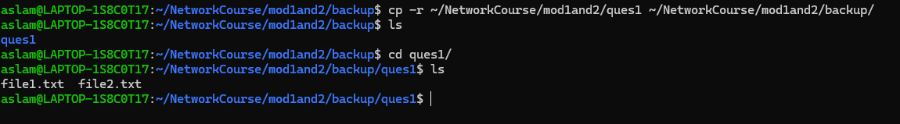


---

## 2. Hosting an FTP and SFTP Server; Performing PUT and GET Operations

- **Install vsftpd (Very Secure FTP Daemon)**:
  ```bash
  sudo apt-get install vsftpd
  ```
- **Start and Enable the FTP Server**:
  ```bash
  sudo systemctl start vsftpd
  sudo systemctl enable vsftpd
  ```
- **Upload (PUT) and Download (GET) a File using FTP**:
  ```bash
  ftp localhost
  put testfile.txt
  get testfile.txt
  ```

**Screenshot:**
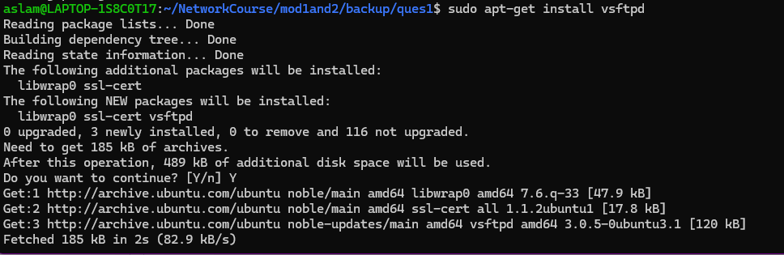
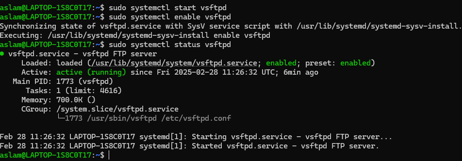
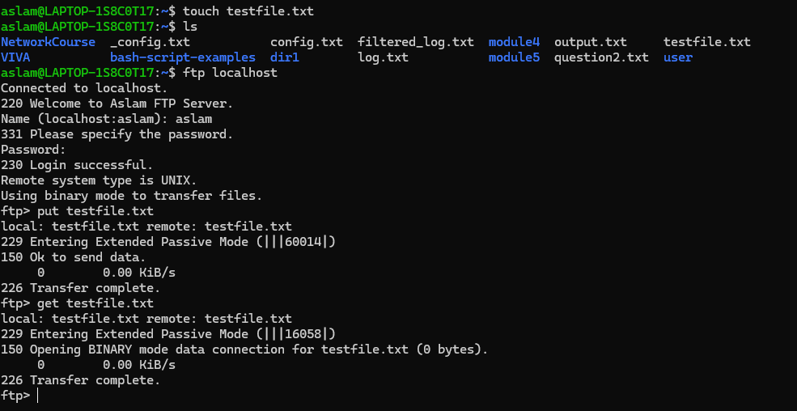

---

## 3. Exploring Wireshark, TCPdump, and Cisco Packet Tracer

- **Wireshark Filter Example**:
  ```
  tcp port 80
  ```
- **Capture Packets using tcpdump**:
  ```bash
  sudo tcpdump -i eth0
  ```

**Screenshot:**

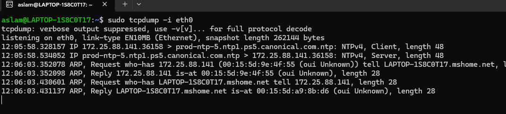

---

## 4. Understanding Linux Utility Commands (ping, arp)

- **Ping a Host (Router at 192.168.1.1)**:
  ```bash
  ping 192.168.1.1
  ```
- **Check ARP Table**:
  ```bash
  arp -a
  ```

**Screenshot:**
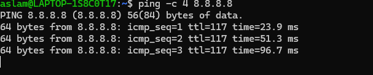
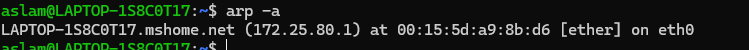

---

## 5. Effects of Duplicate IP Addresses in a Network

- **Impact**:
  - Packet loss and unstable network behavior.
  - ARP conflicts due to duplicate MAC-to-IP mappings.

---

## 6. Accessing Remote Systems (VNC, AnyDesk, TeamViewer, RDP)

- **Use VNC for GUI-based remote control**:
  ```bash
  vncviewer 192.168.1.100
  ```
- **SSH for Secure Remote Access**:
  ```bash
  ssh user@192.168.1.100
  ```

---

## 7. Checking the Default Gateway

- **Command**:
  ```bash
  ip route
  ```

**Screenshot:**
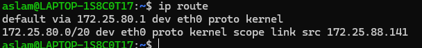

---

## 8. Checking Network Interfaces (ifconfig, ip addr)

- **ifconfig Command**:
  ```bash
  ifconfig
  ```
- **Modern equivalent (ip addr)**:
  ```bash
  ip addr show
  ```

**Screenshot:**
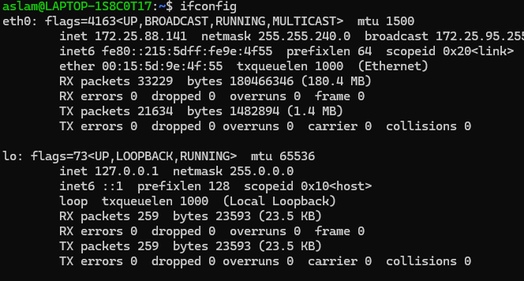
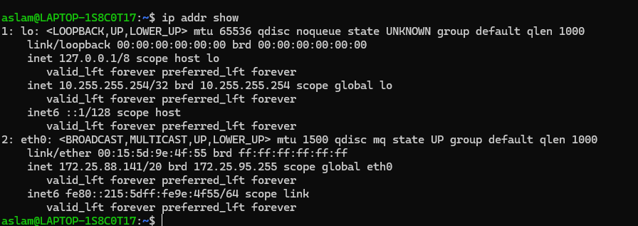

---

## 9. Logging into a Home Router and Checking Connected Devices

- **Access Router Web Interface**:
  ```
  http://192.168.1.1
  ```

**Screenshot:**
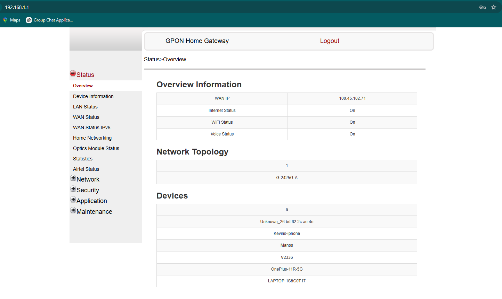

---

## 10. How a DHCP Server Assigns IP Addresses

1. **D**iscover: Client requests IP.
2. **O**ffer: DHCP server sends an available IP.
3. **R**equest: Client accepts.
4. **A**ck: Server confirms assignment.

---

## 11. Connecting to a Remote Machine via SSH and Telnet

- **SSH (Secure Connection)**:
  ```bash
  ssh 21bad051@172.16.16.200
  ```
- **Telnet (Insecure Connection)**:
  ```bash
  telnet 172.16.16.200
  ```

---


