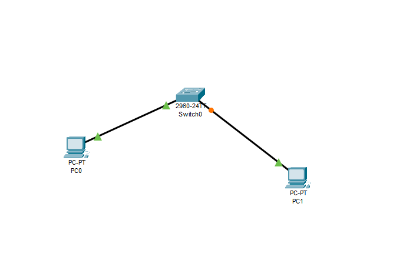
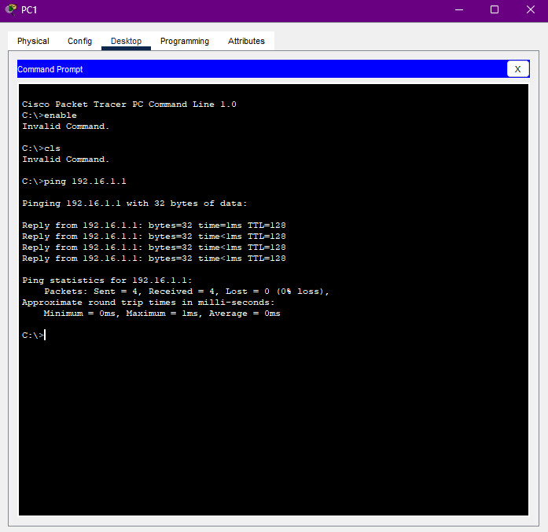
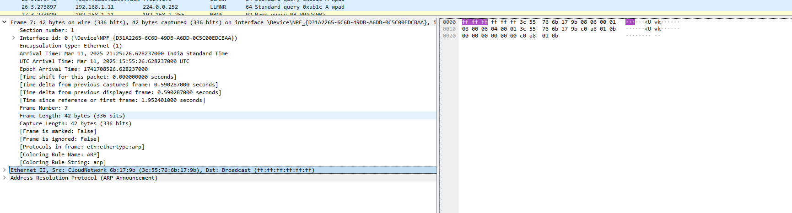
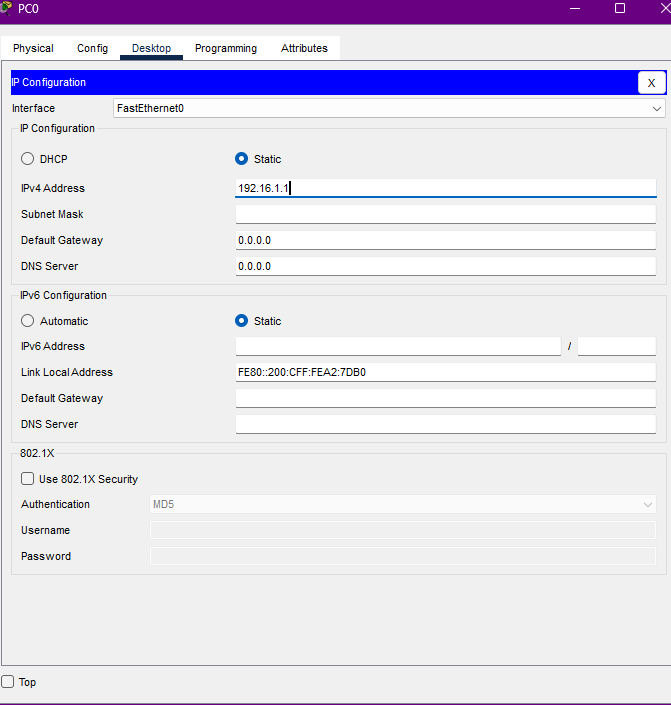
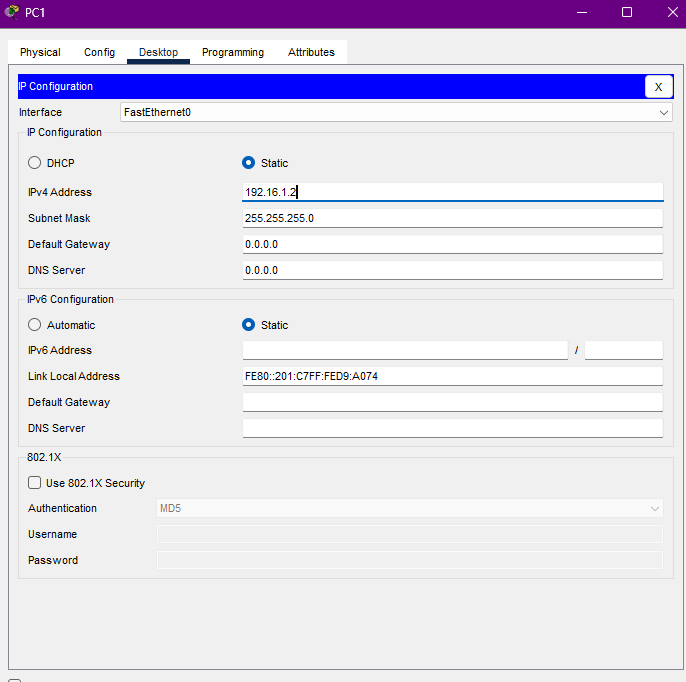
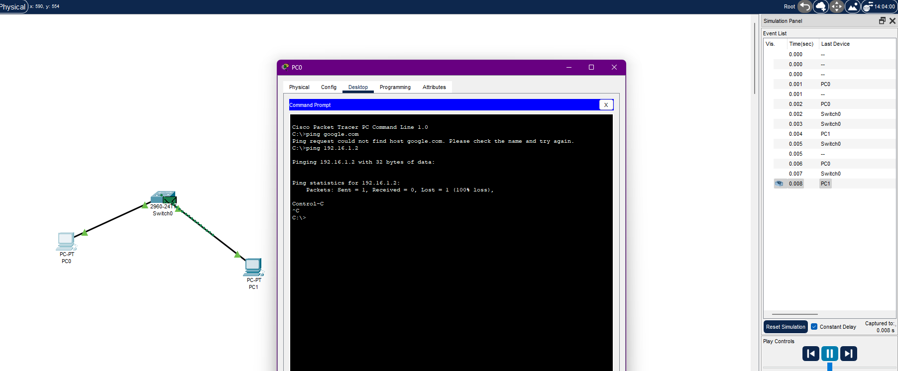
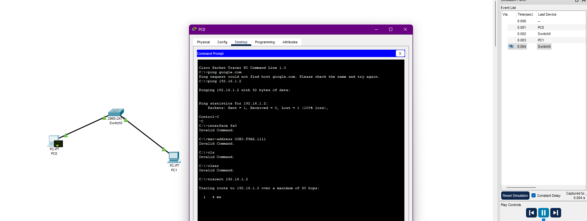
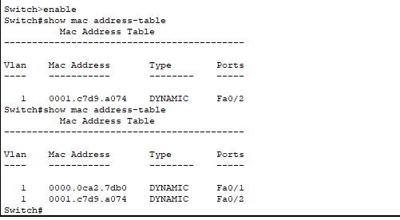

# Networking Training Program (Module 1 & 2)
---

## 1. Simulation of Small Network with Multiple devices

**Screenshot:**

---

## **Capturing and Analyzing Ethernet Frames using Packet Tracer**

**Screenshot:**

---

## 3. Configuring Static IP Address 

**Screenshot:**

---

## 4. Troubleshooting Ethernet Communication

**Screenshot:**

---

## 5. Simple LAN Setup with Switches

**Screenshot:**

---

## 6. Ensuring with Ping command

**Screenshot:**

---

## 7. Checking with Traceroute

**Screenshot:**

---

## 8. Linux Kernel's Handling of Ethernet Devices and Network Interfaces

The Linux kernel manages Ethernet devices via the **netdev** subsystem, enabling communication through network drivers and protocols. It supports interface management using `ip link`, packet transmission via the **socket API**, and device configurations via `/sys/class/net/`. Advanced features like **eBPF** allow efficient packet filtering and monitoring (source: [kernel.org](https://www.kernel.org/)).

---

## 9. Configuring a Basic LAN Interface Using the `ip` Command in Linux

To configure a LAN interface in Linux, first **bring up the interface** using `ip link set eth0 up`. Assign an IP address with `ip addr add 192.168.1.100/24 dev eth0`, then verify with `ip addr show eth0`. For persistence, configurations should be added to `/etc/network/interfaces` or `netplan` (source: [kernel.org](https://www.kernel.org/)).

---

## 10.Viewing the MAC Address Table in a Switch (Cisco & Linux-Based)

In **Cisco switches**, the MAC address table is displayed using `show mac address-table`, as seen below:

On a **Linux-based network switch**, use `bridge fdb show` or `ip link show` to inspect the MAC table and monitor switch operations dynamically.

## 11. Findings and Observations on MAC Address Table and Network Behavior

The **MAC address table** dynamically updates as devices communicate, mapping MAC addresses to switch ports, as shown in the captured output:  

On a **Linux-based switch**, `bridge fdb show` confirms learned addresses, demonstrating how Ethernet frames are forwarded based on MAC lookups, ensuring efficient LAN communication.

