# Networking Training Program (Module 5)
---

## 1. ARP Analysis
* The ARP request is broadcast to discover the MAC address associated with an IP.
* The sender includes both its IP (192.168.164.132) and MAC (f2:5a:32:da:58:bd) so the target knows where to send the reply.
* The reply contains the previously unknown MAC address, completing the address mapping.

**Screenshot:**
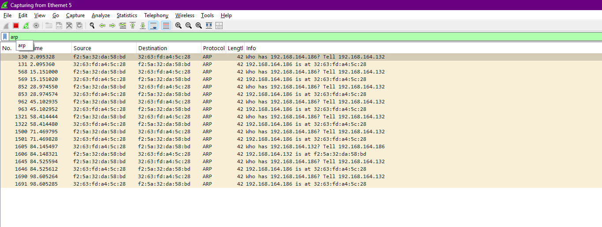
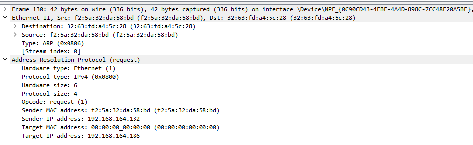

---

## 2. ARP Spoofing
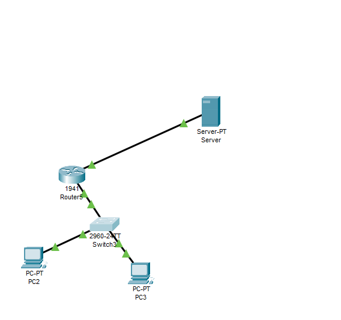
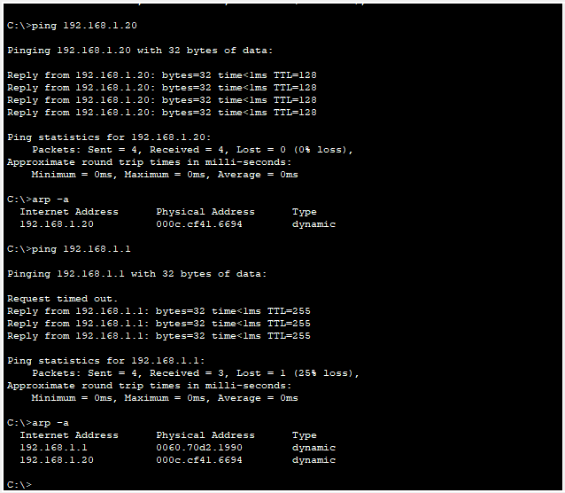
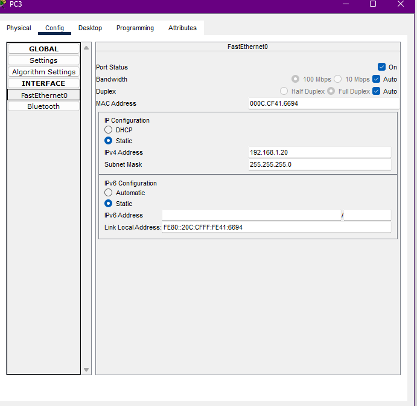
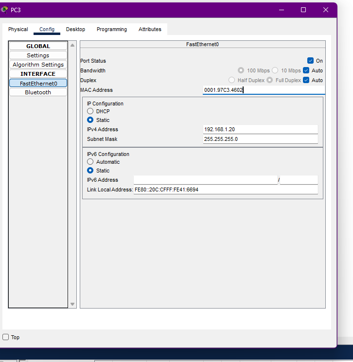
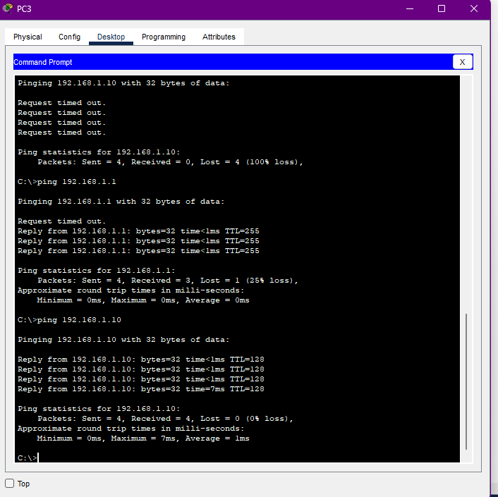\
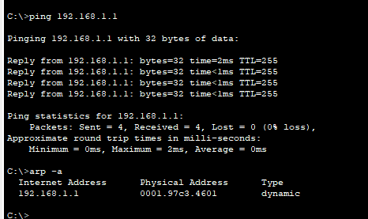

---

## 3. Manual Changing of IP Address
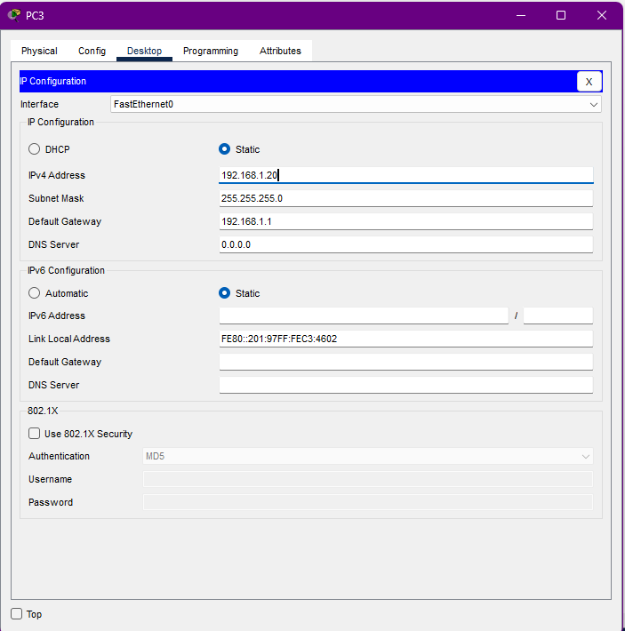
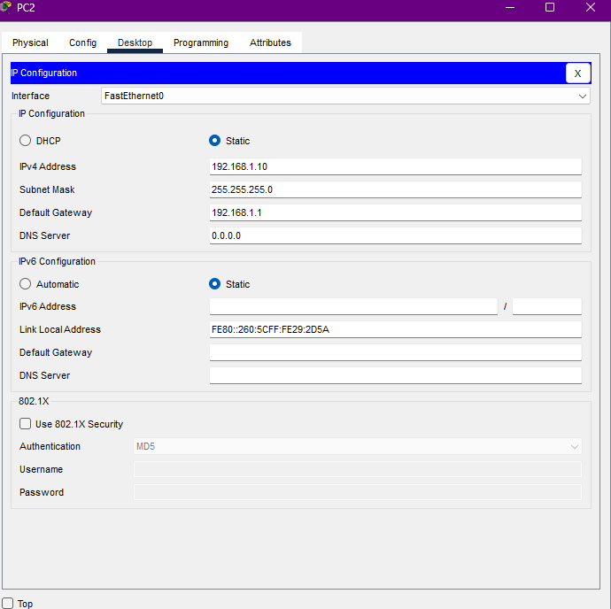
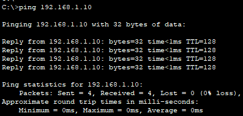

---

## 4. DHCP Packet Capturing

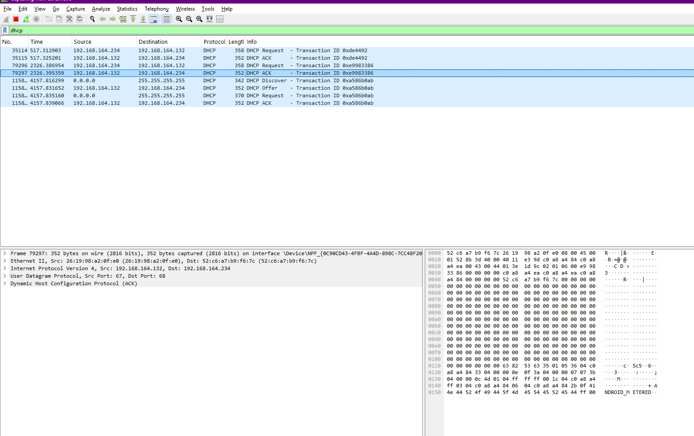

---
## 5. Subnetting Task for 192.168.1.0/24 divided into 4 subnets

### Subnet Mask Calculation

To divide a /24 network into 4 equal subnets:
- Original network: 192.168.1.0/24
- Number of subnets needed: 4
- Bits required for 4 subnets: 2 bits (2² = 4)
- New prefix length: 24 + 2 = /26
- New subnet mask: 255.255.255.192

### Subnet Ranges

| Subnet | Network Address | First Usable IP | Last Usable IP | Broadcast Address |
|--------|----------------|----------------|----------------|-------------------|
| 1      | 192.168.1.0    | 192.168.1.1    | 192.168.1.62   | 192.168.1.63      |
| 2      | 192.168.1.64   | 192.168.1.65   | 192.168.1.126  | 192.168.1.127     |
| 3      | 192.168.1.128  | 192.168.1.129  | 192.168.1.190  | 192.168.1.191     |
| 4      | 192.168.1.192  | 192.168.1.193  | 192.168.1.254  | 192.168.1.255     |

### Calculation Details

- Subnet mask in binary: 11111111.11111111.11111111.11000000
- Subnet mask in decimal: 255.255.255.192
- Number of hosts per subnet: 2^6 - 2 = 62 hosts
- Subnet increment: 64 (256 ÷ 4)

Each subnet provides 62 usable addresses (excluding the network and broadcast addresses).

---

## 6. IP Address Classification

### IP Address Classes for Given Addresses

| IP Address | Class | Default Subnet Mask |
|------------|-------|---------------------|
| 10.1.1.1 | Class A | 255.0.0.0 (/8) |
| 172.16.5.10 | Class B | 255.255.0.0 (/16) |
| 192.168.1.5 | Class C | 255.255.255.0 (/24) |

### IP Address Ranges by Class

- **Class A**: 1.0.0.0 - 126.255.255.255
- **Class B**: 128.0.0.0 - 191.255.255.255
- **Class C**: 192.0.0.0 - 223.255.255.255

---

## 7. NAT

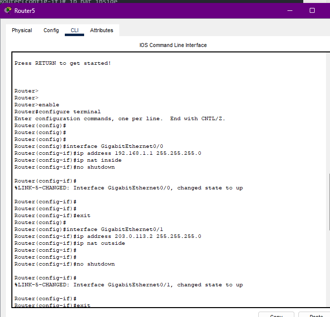
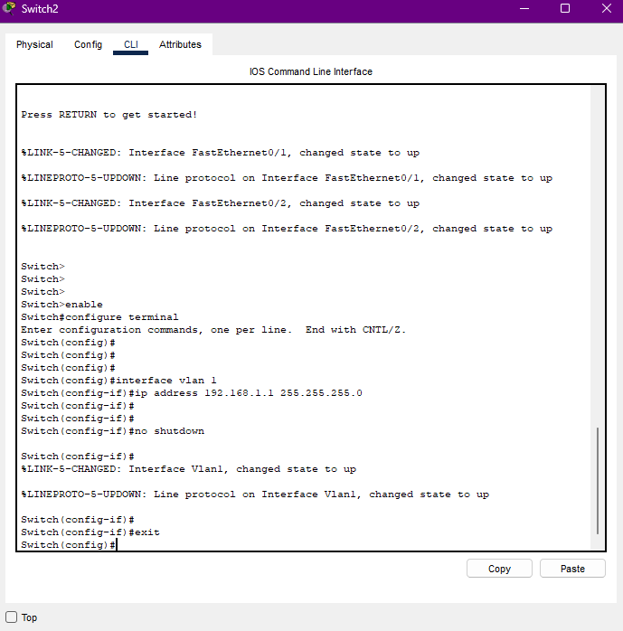

---

