# Networking Training Program (Module 6)
---

## 1. ARP 
- ARP resolves IP addresses to MAC addresses, enabling devices to communicate within a local network.  
- It allows routers to determine the next-hop MAC address for packet forwarding.  
- ARP caching improves efficiency by reducing repeated address lookups.  
- Without ARP, network devices wouldn’t know where to send packets, disrupting communication.  

**Screenshot:**
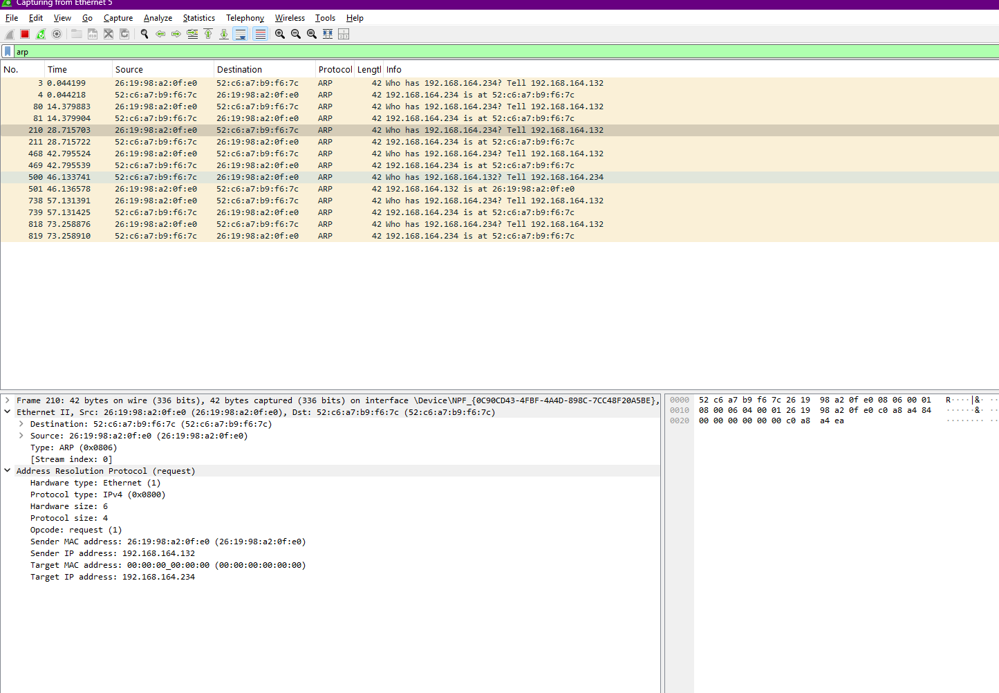


---

## 2. Manually configure and Traceroute Tracking 
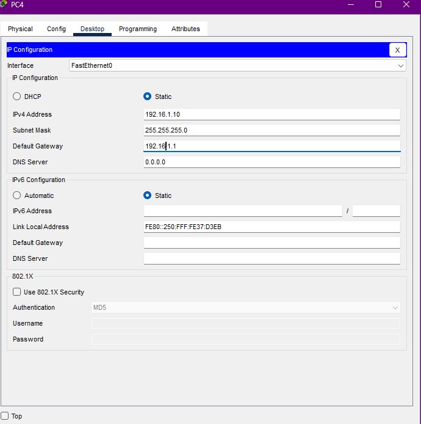
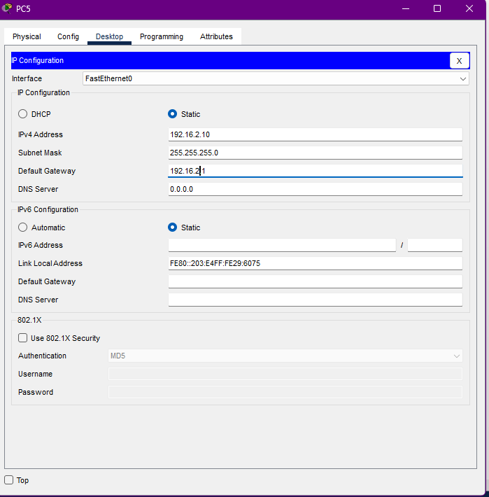
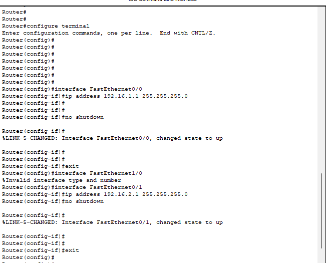
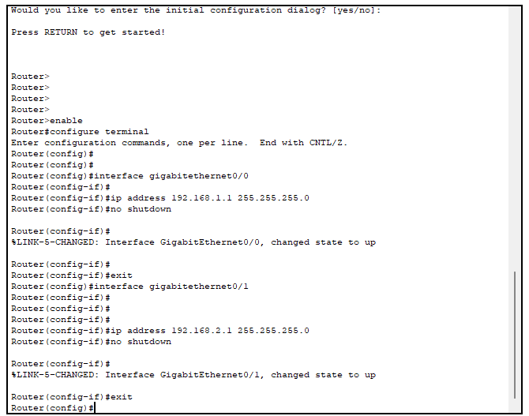\
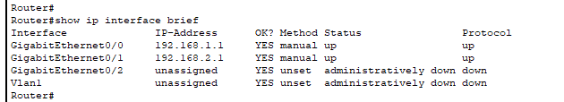
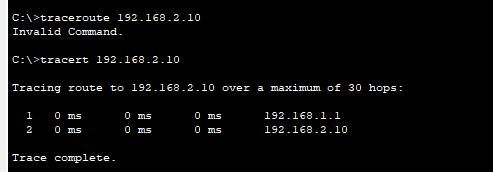

---

## 3. Network Subnetting
### Subnetting 10.0.0.0/24 into 4 Equal Subnets

### 1. **Given Network Information**
- **Network Address:** 10.0.0.0/24  
- **Subnet Mask:** 255.255.255.0  
- **Total Hosts in /24:** 2⁸ - 2 = 254 hosts  
- **Requirement:** Divide into **4 equal subnets**  

### 2. **Calculate the New Subnet Mask**
- To divide into **4 subnets**, we need **2 extra bits** (2² = 4).  
- The new subnet mask becomes **/26 (255.255.255.192)**.  
- Each subnet has **2⁶ - 2 = 62 usable hosts**.

### 3. **Subnet Allocation and Host Ranges**
| Subnet | Network Address | First Usable IP | Last Usable IP | Broadcast Address |
|--------|----------------|-----------------|----------------|-------------------|
| 1      | 10.0.0.0/26    | 10.0.0.1        | 10.0.0.62      | 10.0.0.63        |
| 2      | 10.0.0.64/26   | 10.0.0.65       | 10.0.0.126     | 10.0.0.127       |
| 3      | 10.0.0.128/26  | 10.0.0.129      | 10.0.0.190     | 10.0.0.191       |
| 4      | 10.0.0.192/26  | 10.0.0.193      | 10.0.0.254     | 10.0.0.255       |

### 4. **Assign IP Addresses to Devices in Packet Tracer**
- **Router (Default Gateway)**: Assign **first usable IP** from each subnet.  
- **PCs, Switches**: Assign IPs within the valid host range.

#### **Example Device IP Assignments**
| Device  | Assigned IP      | Subnet Mask         | Gateway       |
|---------|-----------------|---------------------|--------------|
| Router  | 10.0.0.1        | 255.255.255.192    | N/A          |
| PC1     | 10.0.0.2        | 255.255.255.192    | 10.0.0.1     |
| PC2     | 10.0.0.65       | 255.255.255.192    | 10.0.0.64    |
| PC3     | 10.0.0.129      | 255.255.255.192    | 10.0.0.128   |
| PC4     | 10.0.0.193      | 255.255.255.192    | 10.0.0.192   |

### 5. **Verify Connectivity**
1. **Ping Test:**  
   - Use the `ping` command to check connectivity between devices in the same and different subnets.  
   - Example:  
     ```bash
     ping 10.0.0.65
     ```
2. **Traceroute Test:**  
   - Use `tracert` or `traceroute` to check packet paths between different subnets.  
   - Example:  
     ```bash
     tracert 10.0.0.129
     ```
3. **Check Routing Table (On Router):**  
   ```bash
   show ip route

---

## 4. IP Address Classification and NAT Explanation

### 1. **Identifying the Class of Each IP Address**
IP addresses are categorized into different classes based on their first octet.

| IP Address      | First Octet Range | Class |
|---------------|----------------|-------|
| 192.168.10.5 | 192 - 223      | Class C |
| 172.20.15.1  | 128 - 191      | Class B |
| 8.8.8.8      | 1 - 126        | Class A |

### 2. **Determining if the IP is Private or Public**
Some IP ranges are **reserved for private networks**, while others are **public and routable on the internet**.

| IP Address      | Private/Public | Reason |
|---------------|--------------|--------|
| 192.168.10.5 | Private       | Falls in `192.168.0.0 - 192.168.255.255` (Private Class C) |
| 172.20.15.1  | Private       | Falls in `172.16.0.0 - 172.31.255.255` (Private Class B) |
| 8.8.8.8      | Public        | Google DNS, routable on the internet |

---
## 5. NAT Translation

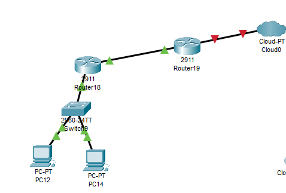
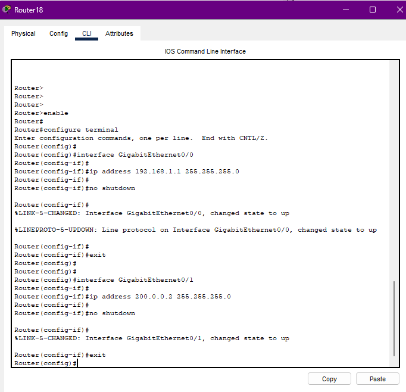
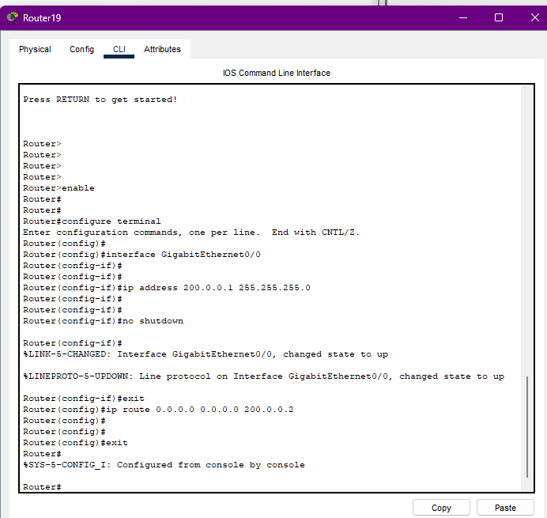
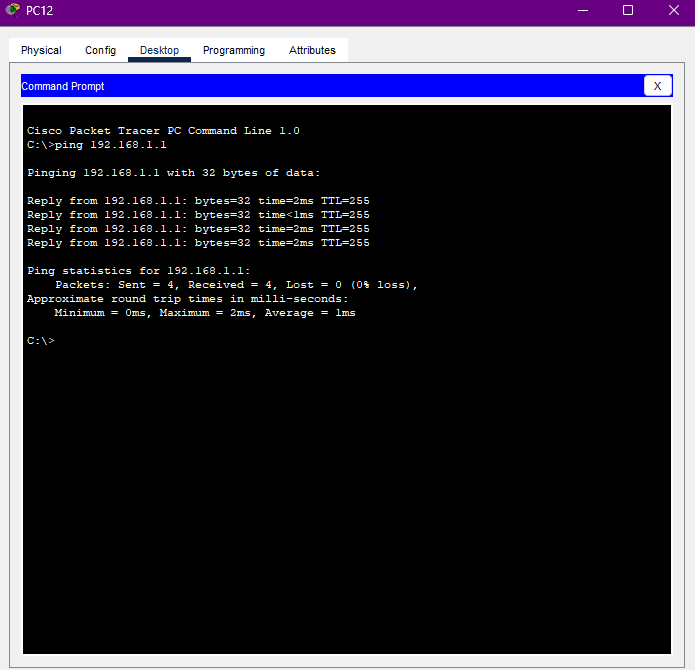
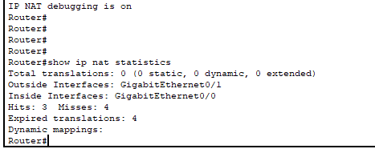


